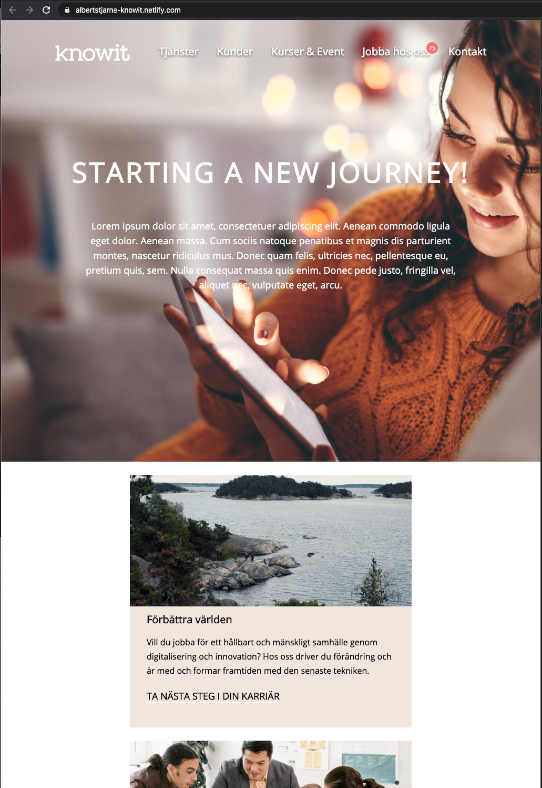

# A knowit tribute

A tribute to knowit built with HTML and CSS. Focus has been to make it appealing and to be fully responsive.

# Screenshots

Screenshots to reflect the breakpoints for media queries.

1920px width

 
 

1350px width

 
 

1200px width

 
 

1000px width, here showing iPhone 6/7/8 Plus width of 414px

 
 

## Author

- Albert Stjärne (https://github.com/AlbertStjarne)
